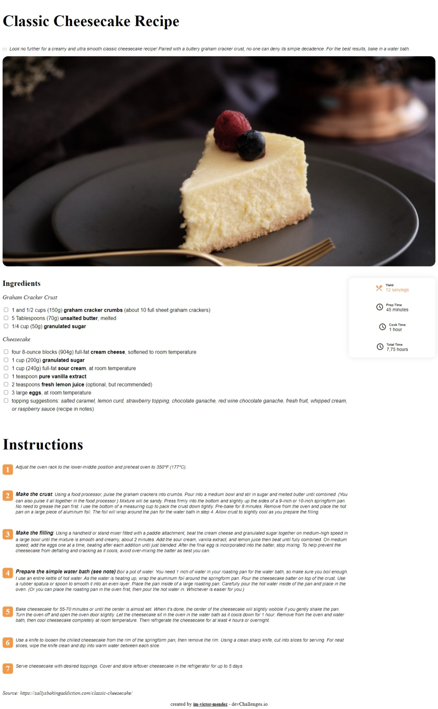

<h1 align="center">{Recipe Pages}</h1>

<div align="center">
   Solution for a challenge from  <a href="http://devchallenges.io" target="_blank">Devchallenges.io</a>.
</div>

<div align="center">
  <h3>
    <a href="https://glistening-tanuki-8d1b42.netlify.app">
      Demo
    </a>
    <span> | </span>
    <a href="https://github.com/im-victor-mendez/CSS-Repice_Pages.git">
      Solution
    </a>
    <span> | </span>
    <a href="https://devchallenges.io/challenges/OEKdUZ6xs0h99C38XVht">
      Challenge
    </a>
  </h3>
</div>

<!-- TABLE OF CONTENTS -->

## Table of Contents

- [Overview](#overview)
  - [Built With](#built-with)
- [Features](#features)
- [How to use](#how-to-use)
- [Contact](#contact)
- [Acknowledgements](#acknowledgements)

<!-- OVERVIEW -->

## Overview



- Where can I see your demo?
    [Netlify](https://glistening-tanuki-8d1b42.netlify.app)
- What was your experience?
    I'm take aproximate of 4 hours 😪, but I'm getting better with display 😄.
    I had some troubles with CSS selector, because sometimes the selector selects all h1 and sometimes no.
- What have you learned/improved?
    Use of display.

### Built With

- [HTML]
- [CSS]
- [GitHub]
- [VSCode]

## Features

This application/site was created as a submission to a [DevChallenges](https://devchallenges.io/challenges) challenge. The [challenge](https://devchallenges.io/challenges/TtUjDt19eIHxNQ4n5jps) was to build an application to complete the following user stories:

- [x] User story: This is a completed user stories
- [ ] User story: This is a incompleted user stories
- [ ] User story: This is a incompleted 2nd user stories

## How To Use

To clone and run this application, you'll need [Git](https://git-scm.com) and [Node.js](https://nodejs.org/en/download/) (which comes with [npm](http://npmjs.com)) installed on your computer. From your command line:

```bash
# Clone this repository
$ git clone https://github.com/im-victor-mendez/CSS-Repice_Pages.git

# Install dependencies
$ npm install

# Run the app
$ npm start
```

## Projects

- Codepen [im-victor-mendez](https://codepen.io/im-victor-mendez)
- GitHub [@im-victor-mendez](https://github.com/im-victor-mendez)
